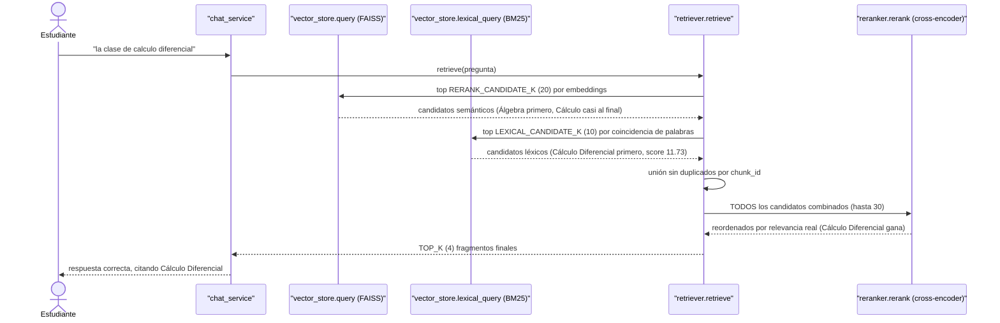
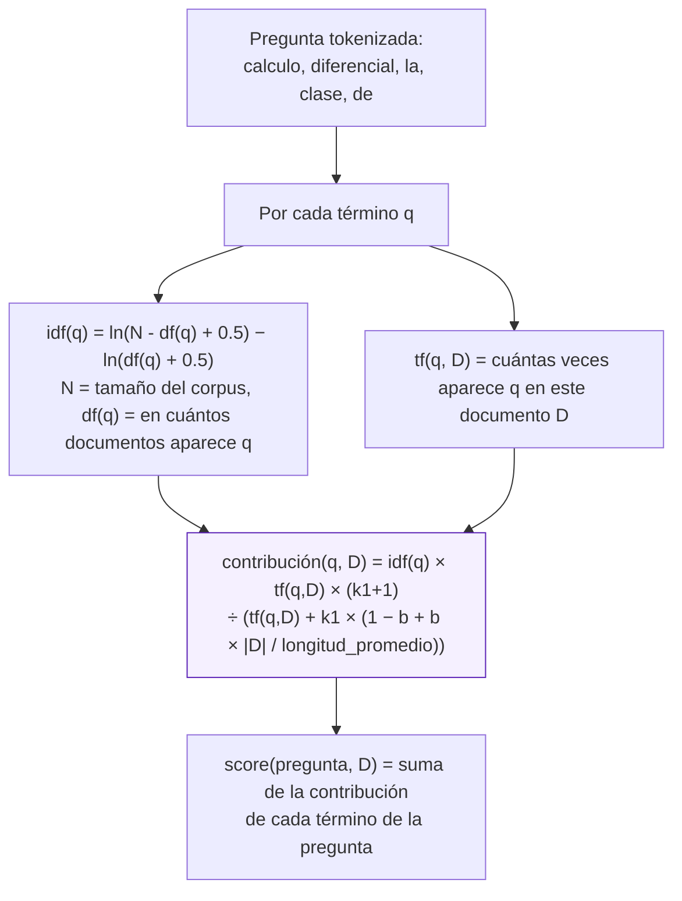

# Búsqueda léxica (BM25): cómo funciona

Este documento explica, con el mecanismo real y números reales del
corpus del proyecto, la segunda vía de recuperación que se agregó junto
a la búsqueda semántica (embeddings + FAISS): una búsqueda **léxica**
-- coincidencia de palabras, no de significado -- que garantiza que un
término exacto entre al proceso de selección sin importar qué tan mal
lo puntúe el modelo de embeddings.

## El problema real que resuelve

Documentado en detalle en
[conceptos-chunks-y-faiss.md](conceptos-chunks-y-faiss.md) y en el
commit que agregó esto: la pregunta **"la clase de calculo
diferencial"** no encontraba la fila real `Materia: Cálculo Diferencial
| Día: Lunes | Hora: 07:00-09:00 | Salón: A101 | Semestre: 1`, aunque
existe tal cual en el Excel de horarios.

Verificado con los vectores reales del índice: el modelo de embeddings
(`paraphrase-multilingual-MiniLM-L12-v2`) le da a esa pregunta más
similitud contra una fila **no relacionada** ("Álgebra Lineal", 0.4734)
que contra su propia fila correcta (0.2698) -- una confusión propia del
modelo para este par específico de frases cortas de matemáticas, no un
problema de cómo se arma el chunk (reformular el texto como oración
natural no lo arregla, ya se probó). En un corpus grande, la fila
correcta puede terminar tan abajo en el ranking por embeddings que ni
ampliar el número de candidatos que se le pasan al re-ranker (ver
[diagrama-de-clases.md](diagrama-de-clases.md) y el comentario de
`RERANK_CANDIDATE_K` en `app/config.py`) alcanza a rescatarla sin volver
el re-ranking prohibitivamente lento.

**BM25 no tiene ese problema**: para la misma pregunta, la fila correcta
saca **11.73** de puntaje, y la fila de "Álgebra Lineal" saca
**0.0** -- exacto, sin ambigüedad, porque "calculo" y "diferencial"
literalmente no aparecen en esa otra fila. La solución es combinar
ambas vías (búsqueda híbrida): lo que a los embeddings les cuesta
distinguir por significado, BM25 lo resuelve por coincidencia literal
de palabras, y viceversa (BM25 no entiende sinónimos ni paráfrasis --
para eso está la vía semántica).

## El flujo completo, con las dos vías



`vector_store.lexical_query` no se llama en paralelo de verdad (Python,
sin async aquí) -- el diagrama muestra el orden lógico; en el código real
(`app/rag/retriever.py::retrieve`) es secuencial: primero `query()`,
después `lexical_query()`, después la unión.

## Cómo funciona BM25 por dentro

BM25 ("Best Matching 25") no mide significado -- mide **qué tan bien
las palabras de la pregunta explican ese documento en particular**,
comparado con el resto del corpus. Tres ideas, todas presentes en la
fórmula real que usa la librería (`rank_bm25.BM25Okapi`, ver su código
fuente):

1. **Frecuencia del término en el documento (`tf`).** Si "calculo"
   aparece más veces en un fragmento, ese fragmento probablemente trata
   más sobre cálculo. Con rendimientos decrecientes (aparecer 10 veces
   no puntúa 10 veces más que aparecer 1 vez) -- eso es lo que controla
   el parámetro `k1` de la fórmula.
2. **Rareza del término en todo el corpus (`idf`, *inverse document
   frequency*).** Una palabra que aparece en casi todos los fragmentos
   (como "de", "la") no ayuda a diferenciar nada -- vale poco. Una
   palabra rara (como "diferencial", que en el corpus de prueba de este
   proyecto solo aparece en 2 de 122 fragmentos) es una señal fuerte
   cuando sí aparece -- vale mucho.
3. **Normalización por longitud del documento.** Un fragmento corto
   donde aparece el término es una señal más fuerte que uno larguísimo
   donde aparece "de pasada" entre mucho más texto -- controlado por el
   parámetro `b`.

La fórmula real (Okapi BM25, con los parámetros por defecto de
`rank_bm25`: `k1=1.5`, `b=0.75`), para una pregunta con términos
`q1, q2, ...` contra un documento `D`:



## El caso real, calculado a mano y verificado contra la librería

Corpus real usado para esta verificación: 122 fragmentos, longitud
promedio 77.52 tokens. El fragmento de "Cálculo Diferencial" tiene
apenas **14 tokens** (`materia calculo diferencial dia lunes hora 07 00
09 00 salon a101 semestre 1` -- ya normalizado: minúsculas, sin
acentos). Pregunta: **"la clase de calculo diferencial"**.

De los 5 términos de la pregunta, solo dos aparecen en este fragmento
(`tf=1` cada uno) -- "la", "clase" y "de" tienen `tf=0` ahí, así que no
aportan nada a **este** puntaje (sí aportarían en otros fragmentos donde
sí aparezcan):

| Término | `df` (en cuántos de los 122 aparece) | `idf` calculado | `tf` en este fragmento | Contribución |
|---|---|---|---|---|
| calculo | 3 | ln(119.5) − ln(3.5) = **3.5306** | 1 | **5.5928** |
| diferencial | 2 | ln(120.5) − ln(2.5) = **3.8754** | 1 | **6.1390** |

Contribución de "calculo" con los números reales:
```
idf × tf×(k1+1) / (tf + k1×(1−b+b×|D|/avgdl))
= 3.5306 × (1×2.5) / (1 + 1.5×(1−0.75+0.75×14/77.52))
= 3.5306 × 2.5 / (1 + 1.5×0.3854)
= 8.8265 / 1.5781
= 5.5928
```

**Suma: 5.5928 + 6.1390 = 11.7318** -- calculado a mano con la fórmula
de arriba, y **confirmado idéntico** (11.731868...) al valor real que
devuelve `BM25Okapi.get_scores()` en este proyecto. Contra la misma
pregunta, la fila de "Álgebra Lineal" saca exactamente **0.0**: ninguno
de sus términos coincide con "calculo" ni "diferencial", así que no
tiene ninguna contribución que sumar.

## Dónde vive en el código real

- **`app/rag/vector_store.py`**: el índice BM25 (`_bm25_index`,
  `BM25Okapi` de la librería `rank_bm25`) se mantiene en memoria junto
  al índice FAISS (`_index`), reconstruido cada vez que cambia
  `_metadata` (subir/eliminar un documento, reconstruir todo) --
  `_rebuild_bm25_index()`. No se persiste a disco: reconstruirlo desde
  cero toma ~25ms incluso con cientos de fragmentos, no vale la pena la
  complejidad de guardarlo aparte.
  - `_normalize_for_bm25(texto)`: minúsculas + quita acentos
    (`unicodedata`) + separa en palabras (regex `[a-z0-9]+`) -- así
    "Cálculo" y "calculo" (como lo escribe un estudiante real, sin
    tilde) tokenizan igual.
  - `lexical_query(pregunta, top_k)`: tokeniza la pregunta igual que los
    documentos, pide los `top_k` puntajes más altos, y descarta los que
    dieron 0 (sin ninguna coincidencia real).
- **`app/rag/retriever.py::retrieve()`**: cuando el re-ranking está
  activo, junta los candidatos de `vector_store.query()` (semántica) y
  `vector_store.lexical_query()` (léxica) en un solo diccionario
  indexado por `chunk_id` (`combined.setdefault(...)`, así un fragmento
  encontrado por ambas vías no se duplica), y le pasa la unión completa
  al cross-encoder (`reranker.rerank`) -- ver
  [diagramas-de-secuencia.md](diagramas-de-secuencia.md) para el resto
  del pipeline de recuperación completo.
- **`app/config.py`**: `LEXICAL_CANDIDATE_K` (por defecto 10) controla
  cuántos candidatos léxicos se agregan como máximo.

## Por qué no reemplaza a la búsqueda semántica

BM25 es literal: no tiene idea de que "profesor" y "docente" son
sinónimos, ni de que "¿cuánto cuesta?" y "valor de la matrícula"
preguntan lo mismo con otras palabras -- ahí la búsqueda semántica sigue
siendo insustituible (ver
[conceptos-embeddings.md](conceptos-embeddings.md)). Las dos vías se
complementan: la semántica encuentra lo que se parece en significado
aunque use otras palabras; la léxica encuentra lo que coincide en
palabras exactas aunque el embedding no lo haya puesto cerca. El
cross-encoder, al final, decide con ambos conjuntos de candidatos ya
sobre la mesa.
