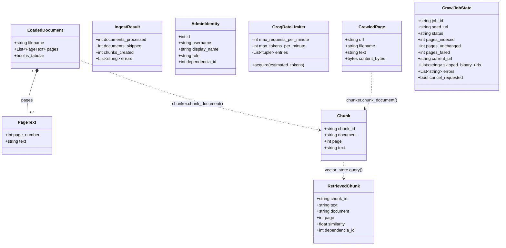

# Diagrama de clases

Este proyecto no usa un ORM ni una jerarquía de clases de dominio: la
persistencia es SQL directo contra SQLite (`app/services/history.py`,
una sola conexión compartida por toda la app) y la lógica vive en
funciones de los módulos de `app/services/` y `app/rag/`, no en objetos
con estado. Por eso este documento muestra las dos familias de "clases"
que sí existen realmente en el código, en vez de inventar una jerarquía
de objetos que no está ahí:

1. **El modelo de datos persistente** -- las 17 tablas reales de
   `history.db`, que son, en la práctica, el verdadero modelo de dominio
   del sistema.
2. **Los objetos en memoria del pipeline de documentos** -- los
   `@dataclass` reales que sí existen en `app/rag/`, usados mientras un
   documento se procesa o una pregunta se responde, pero nunca guardados
   como tales.

Ninguna tabla declara `FOREIGN KEY` -- las relaciones de abajo son
lógicas (un `INTEGER`/`TEXT` que referencia el id de otra tabla por
convención), no restricciones que la base de datos imponga.

## 1. Modelo de datos persistente (`history.db`)

```mermaid
classDiagram
    class Dependencia["Dependencia (dependencias)"] {
        +int id
        +string name
        +string description
        +string horario_dias
        +string horario_rangos
        +string created_at
    }

    class Admin["Admin (admins)"] {
        +int id
        +string username
        +string password_hash
        +string display_name
        +string role
        +int dependencia_id
        +bool active
        +string created_at
    }

    class AdminSession["AdminSession (admin_sessions)"] {
        +string token
        +int admin_id
        +string created_at
        +string expires_at
    }

    class SesionEstudiante["SesionEstudiante (session_meta)"] {
        +string session_id
        +bool needs_human
        +string student_name
        +string student_email
        +string student_phone
        +int dependencia_id
        +string dependencia_assigned_at
        +string escalated_at
        +string first_response_at
        +string resolved_at
        +string resolved_by
        +int hostility_strikes
        +string hostility_blocked_until
    }

    class Turno["Turno (turns)"] {
        +int id
        +string session_id
        +string question
        +string answer
        +string created_at
    }

    class MensajeAsesor["MensajeAsesor (admin_messages)"] {
        +int id
        +string session_id
        +string sender
        +string sender_name
        +string message
        +string message_type
        +string created_at
    }

    class FaqCandidate["FaqCandidate (faq_candidates)"] {
        +int id
        +string session_id
        +int dependencia_id
        +string original_question
        +string original_answer
        +string suggested_question
        +string suggested_answer
        +string status
        +string created_at
        +string decided_at
    }

    class ChatMetric["ChatMetric (chat_metrics)"] {
        +int id
        +string session_id
        +float retrieval_ms
        +float generation_ms
        +float total_ms
        +int chunks_retrieved
        +bool cache_hit
        +string created_at
    }

    class AnswerFeedback["AnswerFeedback (answer_feedback)"] {
        +string session_id
        +string turn_created_at
        +string rating
        +string created_at
    }

    class DocumentDependencia["DocumentDependencia (document_dependencias)"] {
        +string filename
        +int dependencia_id
        +string vigente_desde
        +string archived_at
        +bool downloadable
        +string source_url
        +string updated_at
    }

    class DocumentHash["DocumentHash (document_hashes)"] {
        +string content_hash
        +string filename
        +string created_at
    }

    class CrawlPendingFile["CrawlPendingFile (crawl_pending_files)"] {
        +int id
        +string url
        +string seed_url
        +int dependencia_id
        +string created_at
    }

    class GroqCall["GroqCall (groq_calls)"] {
        +int id
        +string purpose
        +bool success
        +string created_at
    }

    class AnswerCache["AnswerCache (answer_cache)"] {
        +string context_hash
        +string question_example
        +string answer
        +int hit_count
        +string created_at
        +string last_used_at
    }

    class HostilityKeyword["HostilityKeyword (hostility_keywords)"] {
        +int id
        +string phrase
        +string created_at
    }

    class WidgetAllowedOrigin["WidgetAllowedOrigin (widget_allowed_origins)"] {
        +int id
        +string origin
        +string created_at
    }

    class InstitutionSettings["InstitutionSettings (institution_settings)"] {
        +int id
        +string name
        +string logo_filename
        +string extra_info
        +string updated_at
    }

    Dependencia "1" --> "0..*" Admin : dependencia_id (rol dependencia)
    Dependencia "1" --> "0..*" SesionEstudiante : dependencia_id
    Dependencia "1" --> "0..*" DocumentDependencia : dependencia_id
    Dependencia "1" --> "0..*" FaqCandidate : dependencia_id
    Dependencia "1" --> "0..*" CrawlPendingFile : dependencia_id (opcional)
    Admin "1" --> "0..*" AdminSession : admin_id
    SesionEstudiante "1" --> "0..*" Turno : session_id
    SesionEstudiante "1" --> "0..*" MensajeAsesor : session_id
    SesionEstudiante "1" --> "0..*" FaqCandidate : session_id
    SesionEstudiante "1" --> "0..*" ChatMetric : session_id
    SesionEstudiante "1" --> "0..*" AnswerFeedback : session_id
```

**Notas de lectura:**

- El primer atributo de cada clase es su clave primaria real (o, en
  `AnswerFeedback`, la clave compuesta `session_id` + `turn_created_at`
  -- un estudiante puede cambiar de opinión sobre la misma respuesta,
  por eso el `INSERT OR REPLACE` usa ambos campos juntos).
- `HostilityKeyword`, `WidgetAllowedOrigin`, `InstitutionSettings`,
  `GroqCall`, `AnswerCache` y `DocumentHash` no tienen relación con
  ninguna otra tabla -- son configuración global o registros
  independientes, no datos por sesión ni por dependencia.
- `CrawlPendingFile` tiene un `dependencia_id` opcional (la que se eligió
  al lanzar ese rastreo), pero es puramente informativo -- no participa
  del enrutamiento de preguntas como sí lo hace `DocumentDependencia`.
  Cada fila es un PDF/DOCX/XLSX que un rastreo de sitio web (ver
  [flujo-subida-documentos.md](flujo-subida-documentos.md)) encontró
  pero no indexó automáticamente; desaparece cuando root la descarta,
  no cuando se "resuelve" nada -- no hay un estado intermedio.
- `downloadable` en `DocumentDependencia` es `1` (descargable) por
  defecto; en `0`, el documento sigue indexado y respondiendo preguntas
  normalmente, pero el estudiante no ve botón de descarga para él.
  `source_url` es `NULL` para un documento subido a mano, y la URL real
  de origen para uno que llegó vía un rastreo de sitio web -- en ese
  caso, el estudiante ve un enlace a esa URL en vez de un botón de
  descarga (no hay archivo "original" que servir).
- El **contenido real de los documentos no vive aquí**: `DocumentDependencia`
  solo guarda la etiqueta de dependencia y el estado (vigente/archivado)
  de un archivo por su nombre -- los fragmentos de texto y sus vectores
  viven en el índice FAISS (`index.faiss` + `metadata.json`), fuera de
  SQLite por completo (ver
  [conceptos-chunks-y-faiss.md](conceptos-chunks-y-faiss.md)).
- `dependencia_id` es `NULL` con significado propio en varias tablas: en
  `SesionEstudiante` y `FaqCandidate`, "sin clasificar / bandeja del
  general"; en `DocumentDependencia`, "documento general/compartido".

## 2. Objetos en memoria del pipeline de documentos (`app/rag/`)

Estos `@dataclass` nunca se guardan tal cual -- existen solo mientras
dura una subida de documento o una búsqueda, y transportan datos entre
funciones de un mismo pipeline (ver
[flujo-subida-documentos.md](flujo-subida-documentos.md) y
[flujo-chat-en-vivo.md](flujo-chat-en-vivo.md)).

**Notas de lectura:**

- `LoadedDocument` sí **contiene** literalmente su lista de `PageText`
  (composición real: `pages: List[PageText]`) -- si se destruye el
  `LoadedDocument`, sus páginas van con él.
- Las flechas punteadas (`..>`) no son composición: son la
  transformación real del pipeline -- `document_loader.load_document`
  produce un `LoadedDocument`, `chunker.chunk_document` lo convierte en
  una lista de `Chunk`, y `vector_store.query` (búsqueda en FAISS) hace
  el camino inverso al devolver un `RetrievedChunk` por cada `Chunk`
  encontrado (mismos `chunk_id`/`document`/`page`, más `similarity` y
  `dependencia_id` calculados en ese momento).
- `IngestResult` y `AdminIdentity` son resultados/contexto de una sola
  operación (una subida completa, o una sesión de administrador
  autenticada) -- no se relacionan estructuralmente con los demás.
- `GroqRateLimiter` es la única clase con comportamiento real (no solo
  datos): una sola instancia por proceso, compartida por todas las
  funciones de `app/rag/llm.py` que llaman a Groq (ver
  `app/rag/rate_limiter.py`).
- `CrawledPage` (`app/rag/web_crawler.py`) es análoga a `LoadedDocument`
  pero para una página web: si es HTML, trae `text` (ya extraído por
  `trafilatura`, sin menús ni pie de página) y pasa por el mismo
  `chunker.chunk_document()` que cualquier otro documento; si es un
  PDF/DOCX/XLSX enlazado, trae `content_bytes` en vez de `text` y **no**
  se convierte en `Chunk` -- queda pendiente de subida manual (ver
  `CrawlPendingFile` en la sección 1).
- `CrawlJobState` (`app/services/crawl_job_service.py`) es el estado en
  memoria de un rastreo en curso -- progreso consultable en vivo desde
  el panel, cancelable a mitad de camino. A diferencia de todo lo demás
  en esta sección, vive más que una sola operación puntual (un rastreo
  real puede tomar minutos) pero tampoco se persiste: si el servidor se
  reinicia a mitad de un rastreo, este objeto se pierde (las páginas ya
  indexadas hasta ese momento no, ver
  [flujo-subida-documentos.md](flujo-subida-documentos.md)).

## Y los ~50 esquemas de `app/models/schemas.py`

FastAPI usa un modelo Pydantic (`BaseModel`) distinto por cada forma de
petición/respuesta HTTP (`ChatRequest`, `EscalateRequest`,
`DashboardResponse`, etc.) -- son **contratos de la API**, no clases de
dominio: casi todos son un subconjunto de campos de las tablas de arriba,
moldeado para lo que un endpoint puntual necesita recibir o devolver. Por
eso no se diagraman aquí uno por uno; la referencia completa de cada
endpoint y su forma real está en
[casos-de-uso.md](casos-de-uso.md) (qué hace cada uno) y directamente en
`app/models/schemas.py` (los campos exactos).
