# Diagramas de secuencia

Complemento visual de los documentos de flujo
([flujo-chat-en-vivo.md](flujo-chat-en-vivo.md),
[flujo-escalamiento-y-atencion-humana.md](flujo-escalamiento-y-atencion-humana.md),
[flujo-subida-documentos.md](flujo-subida-documentos.md),
[widget-embebible.md](widget-embebible.md)) y de
[casos-de-uso.md](casos-de-uso.md): los mismos mecanismos reales, en
formato de diagrama de secuencia (sintaxis [Mermaid](https://mermaid.js.org/syntax/sequenceDiagram.html),
se renderiza directamente en GitHub). Cada diagrama enlaza al documento
con la explicación completa en prosa -- aquí solo se anota lo
imprescindible para leerlo.

## Índice

1. [Pregunta al asistente virtual (chat en vivo)](#1-pregunta-al-asistente-virtual-chat-en-vivo)
2. [Escalar a atención humana](#2-escalar-a-atención-humana)
3. [El asesor responde](#3-el-asesor-responde)
4. [El asesor le pide ayuda al chatbot (sin enviar nada al estudiante)](#4-el-asesor-le-pide-ayuda-al-chatbot-sin-enviar-nada-al-estudiante)
5. [Redirección automática por SLA vencido](#5-redirección-automática-por-sla-vencido)
6. [Subir e indexar un documento](#6-subir-e-indexar-un-documento)
6a. [Indexar un sitio web (rastreo)](#6a-indexar-un-sitio-web-rastreo)
6b. [Marcar un documento como no descargable](#6b-marcar-un-documento-como-no-descargable)
7. [Generar y aceptar una sugerencia de FAQ](#7-generar-y-aceptar-una-sugerencia-de-faq)
8. [Detección de hostilidad y bloqueo temporal](#8-detección-de-hostilidad-y-bloqueo-temporal)
9. [Embeber el chat en un sitio externo (widget)](#9-embeber-el-chat-en-un-sitio-externo-widget)

---

## 1. Pregunta al asistente virtual (chat en vivo)

Ver [flujo-chat-en-vivo.md](flujo-chat-en-vivo.md) para el detalle de
cada paso con tiempos reales medidos, y
[busqueda-lexica-bm25.md](busqueda-lexica-bm25.md) para el mecanismo
completo (semántica + léxica + re-ranking) dentro de "Retriever".

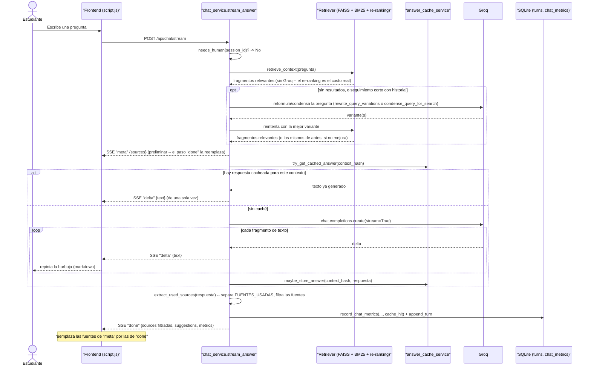

---

## 2. Escalar a atención humana

Ver [flujo-escalamiento-y-atencion-humana.md, sección 1](flujo-escalamiento-y-atencion-humana.md#1-el-estudiante-escala----post-apiescalate).

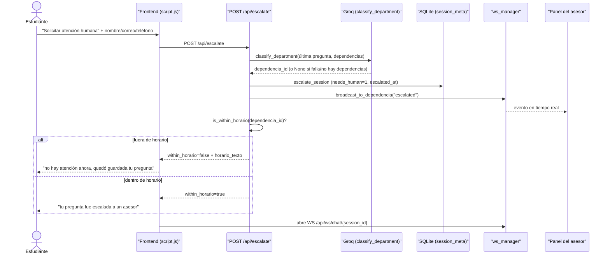

---

## 3. El asesor responde

El mismo mecanismo aplica a "¿Necesita algo más?" (`ask-continue`), con
un texto fijo en vez del mensaje libre. Ver
[flujo-escalamiento-y-atencion-humana.md, secciones 2 y 6](flujo-escalamiento-y-atencion-humana.md#2-el-asesor-responde----post-adminsessionsidreply)
para las reglas de permiso y el detalle de `_advisor_label`.

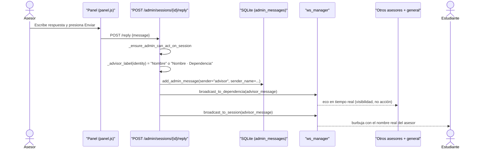

---

## 4. El asesor le pide ayuda al chatbot (sin enviar nada al estudiante)

Ver [flujo-escalamiento-y-atencion-humana.md, sección 3](flujo-escalamiento-y-atencion-humana.md#3-herramienta-de-apoyo-del-asesor----post-adminsessionsidask-bot).

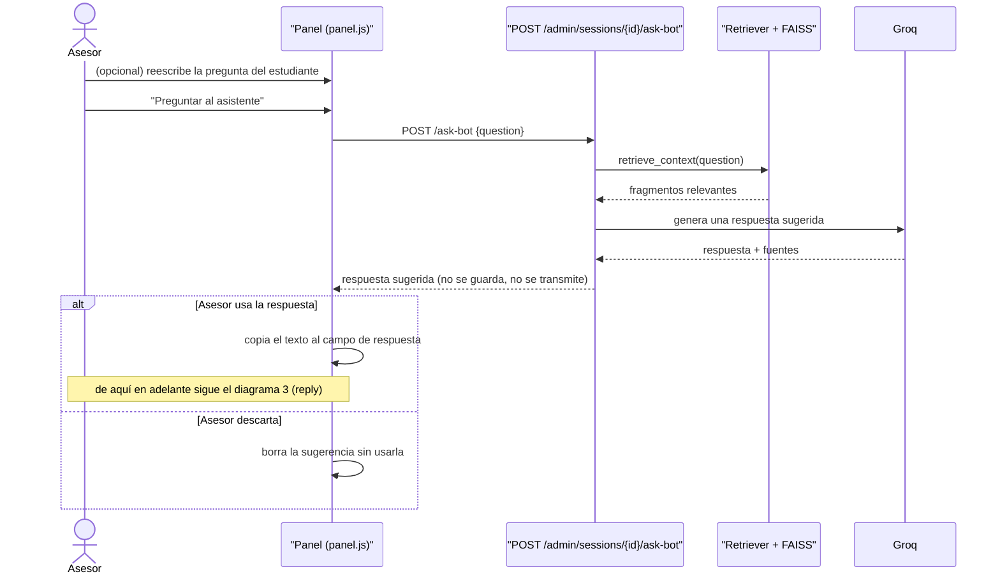

---

## 5. Redirección automática por SLA vencido

Reusa exactamente el mismo `_perform_reassignment` que la redirección
manual del panel ("Redirigir a..."). Ver
[flujo-escalamiento-y-atencion-humana.md, sección 5](flujo-escalamiento-y-atencion-humana.md#5-redirigirreclamar-una-conversación----_perform_reassignment).

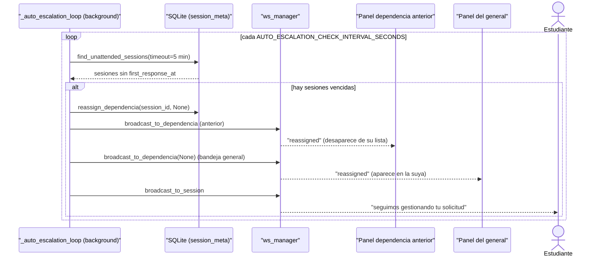

---

## 6. Subir e indexar un documento

Ver [flujo-subida-documentos.md](flujo-subida-documentos.md) para el
detalle de conversión PDF/DOCX→TXT, paginación por formato y por qué el
XLSX no se aplana a texto plano.

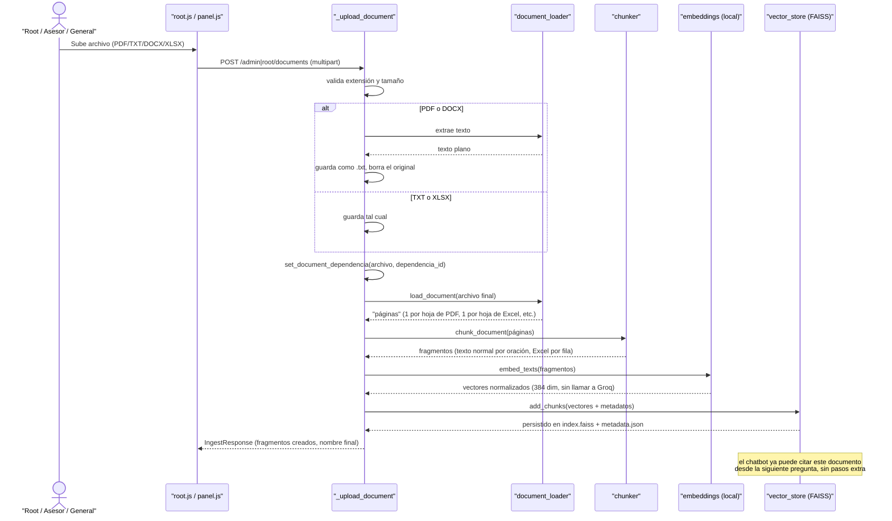

Este mismo tramo (`Loader` opcional → `Chunker` → `Emb` → `FAISS`) es
justo el que reutiliza el rastreo de sitio web (diagrama 6a) por cada
página nueva o cambiada -- no es un pipeline aparte, es el mismo con
otra fuente de entrada.

---

## 6a. Indexar un sitio web (rastreo)

Ver [flujo-subida-documentos.md, sección 8](flujo-subida-documentos.md#8-vía-alterna-rastreo-automático-de-un-sitio-web)
y CU-31a/CU-31b/CU-38a en [casos-de-uso.md](casos-de-uso.md). Exclusivo
de root.

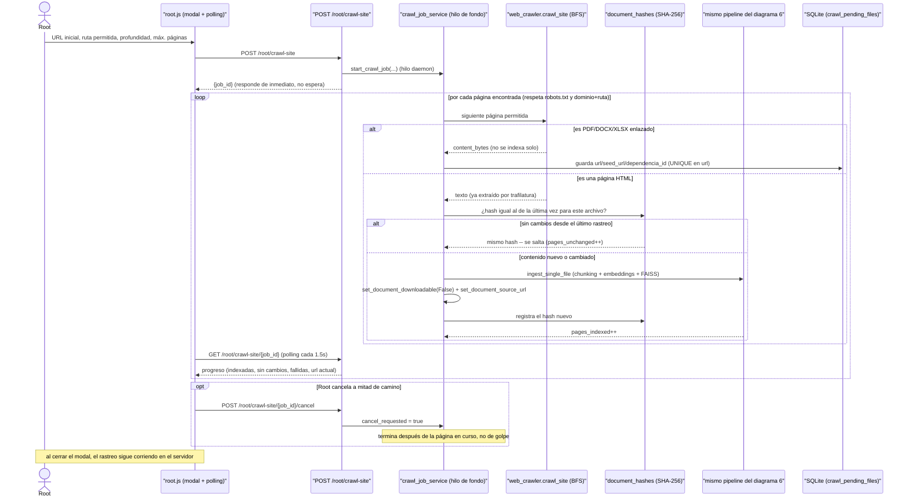

---

## 6b. Marcar un documento como no descargable

Ver CU-18a/CU-23/CU-31 en [casos-de-uso.md](casos-de-uso.md).

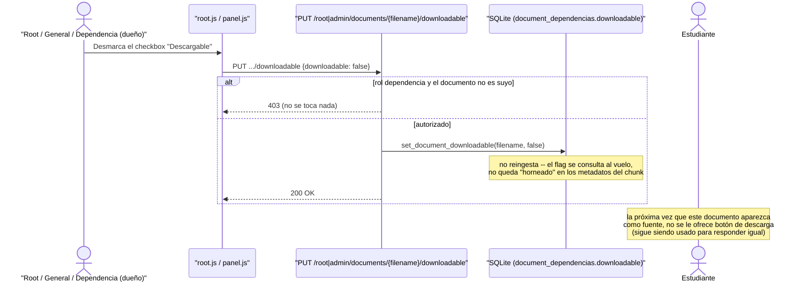

---

## 7. Generar y aceptar una sugerencia de FAQ

Ver CU-32 y CU-37 en [casos-de-uso.md](casos-de-uso.md).

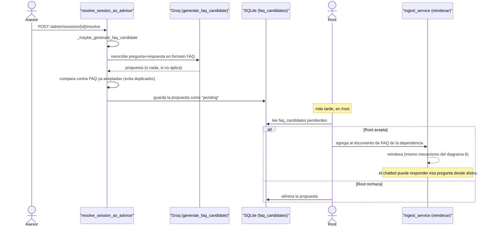

---

## 8. Detección de hostilidad y bloqueo temporal

Ver `app/services/hostility_service.py` y CU-39 en
[casos-de-uso.md](casos-de-uso.md).

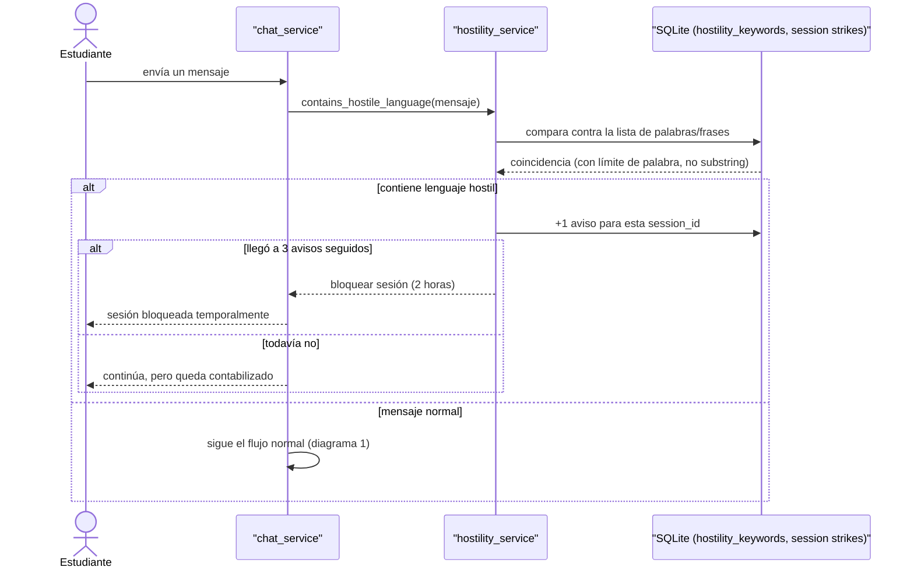

---

## 9. Embeber el chat en un sitio externo (widget)

Ver [widget-embebible.md](widget-embebible.md) para la explicación
completa de por qué `frame-ancestors` es una restricción del navegador,
no del backend.

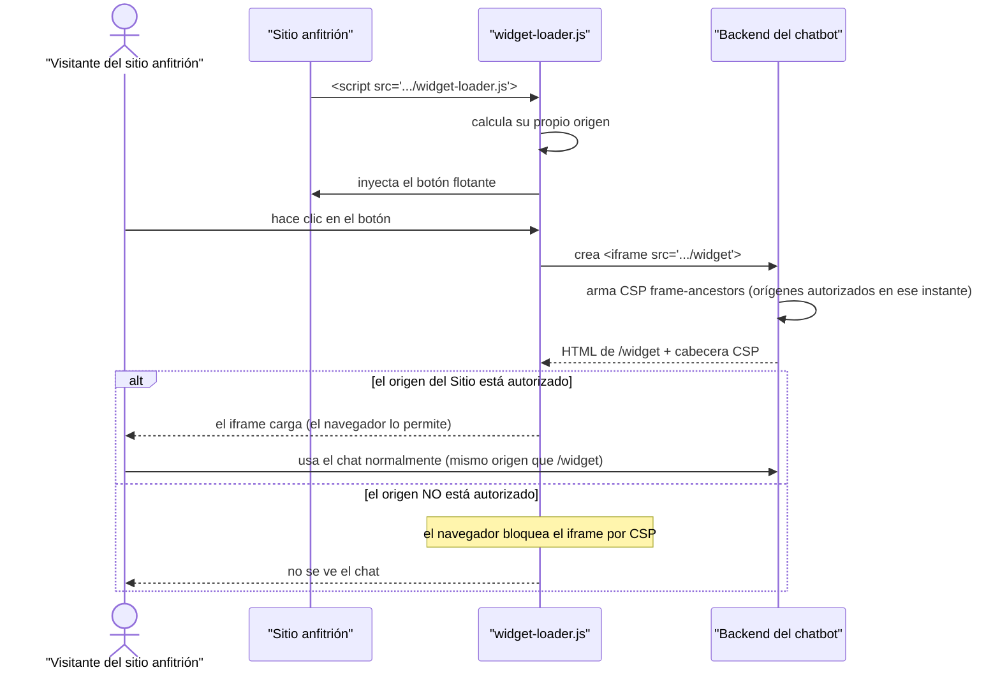
